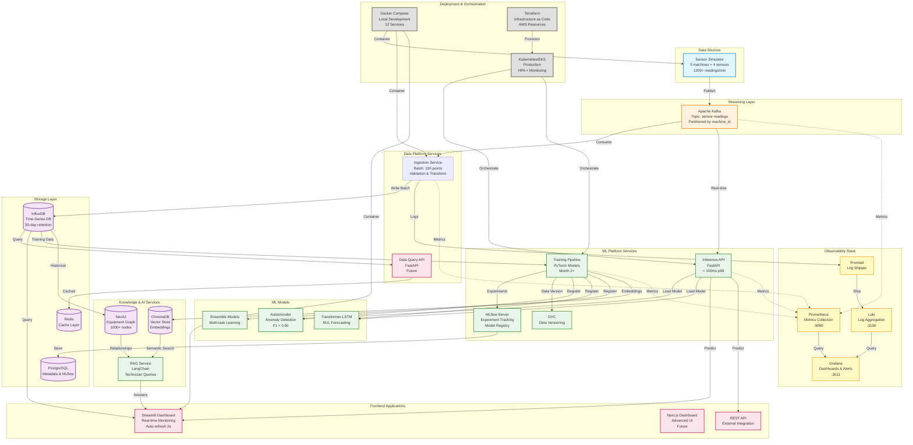
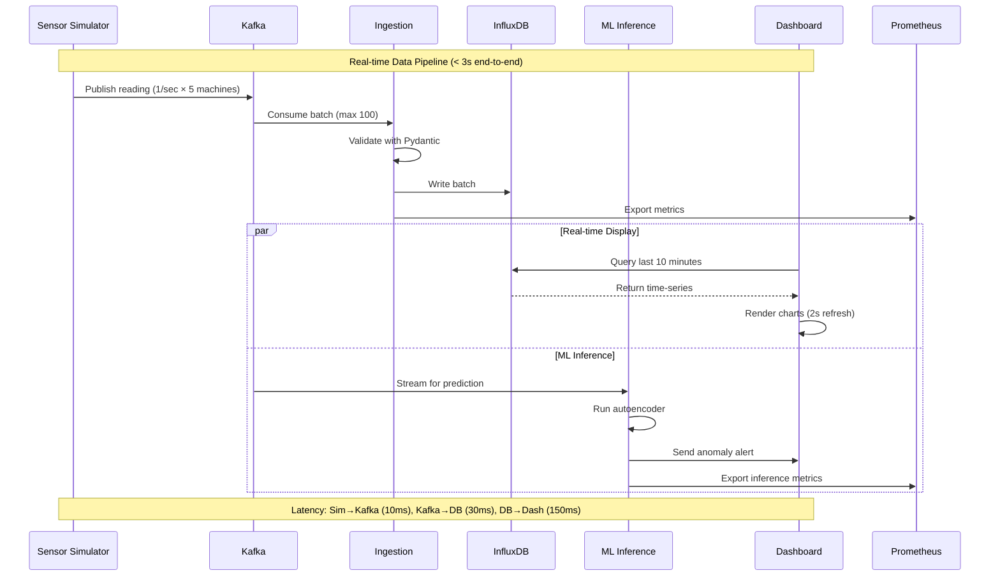
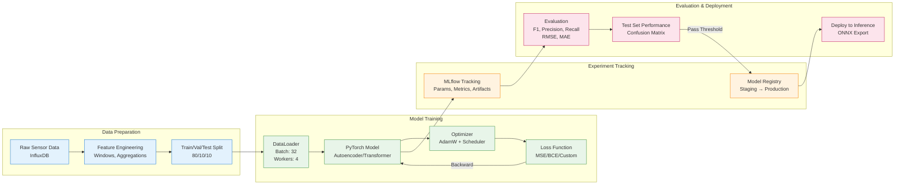
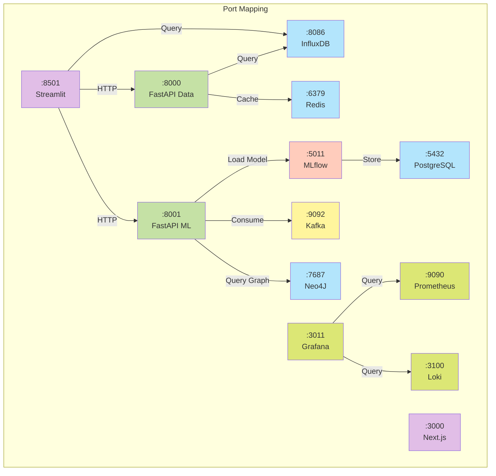
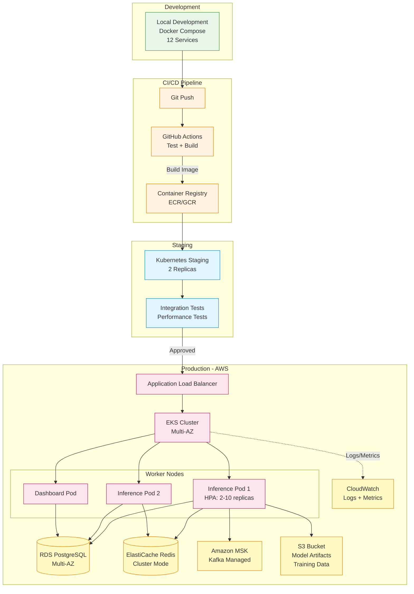
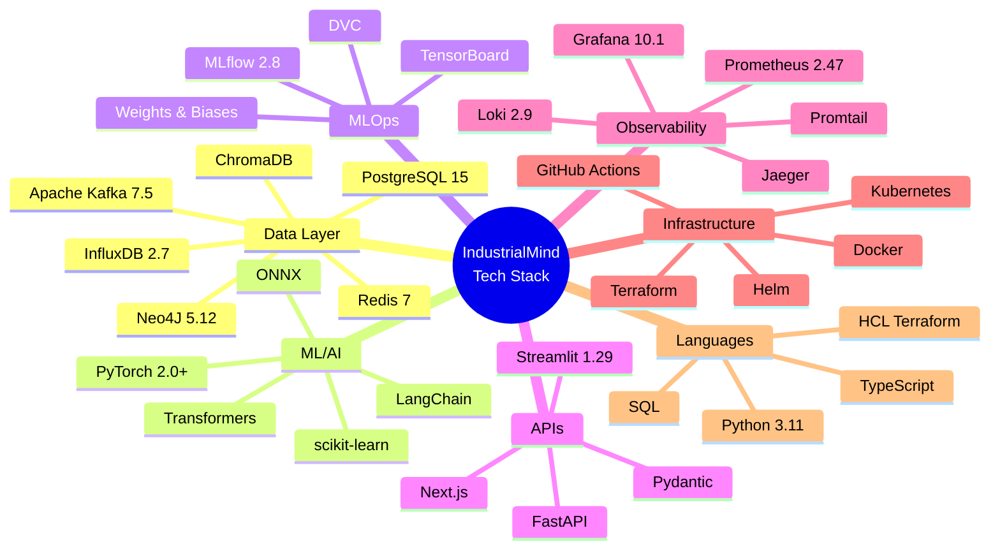
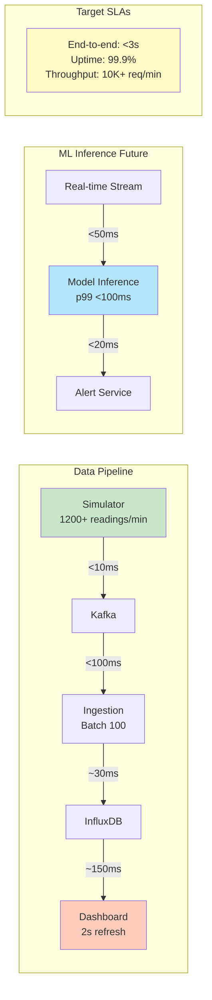

# IndustrialMind Architecture Diagram

## System Overview

## Data Flow Architecture

## ML Training Pipeline

## Microservices Communication

## Deployment Architecture

## Technology Stack Summary

## Component Status Matrix

| Component | Status | Coverage | Performance | Documentation |
|-----------|--------|----------|-------------|---------------|
| **Sensor Simulator** | ✅ Deployed | 85% | 1200+/min | ✅ Complete |
| **Kafka Streaming** | ✅ Deployed | N/A | <10ms latency | ✅ Complete |
| **Ingestion Service** | ✅ Deployed | 78% | 30ms writes | ✅ Complete |
| **InfluxDB Storage** | ✅ Deployed | N/A | 150ms queries | ✅ Complete |
| **Streamlit Dashboard** | ✅ Deployed | 82% | 2s refresh | ✅ Complete |
| **Observability Stack** | ✅ Deployed | N/A | Real-time | ✅ Complete |
| **PyTorch Autoencoder** | 🏗️ Month 2 | Target 90% | Target <100ms | 📝 In Progress |
| **Transformer Model** | 📅 Month 3 | Target 90% | Target <100ms | 📋 Planned |
| **MLflow Integration** | 📅 Month 3 | N/A | N/A | 📋 Planned |
| **FastAPI Inference** | 📅 Month 4 | Target 85% | Target <50ms | 📋 Planned |
| **Neo4J Graph** | 📅 Month 5 | N/A | <500ms | 📋 Planned |
| **RAG System** | 📅 Month 6 | Target 80% | <2s | 📋 Planned |
| **LLM Fine-tuning** | 📅 Month 7 | N/A | <1s | 📋 Planned |
| **Kubernetes Deploy** | 📅 Month 8 | N/A | Auto-scale | 📋 Planned |

**Legend**: ✅ Deployed | 🏗️ In Development | 📅 Planned | 📝 Documenting | 📋 Planning

## Performance Metrics

---

## Quick Navigation

- **Main README**: [README.md](../README.md)
- **Detailed Architecture**: [ARCHITECTURE.md](ARCHITECTURE.md)
- **Logging Implementation**: [LOGGING_IMPLEMENTATION.md](LOGGING_IMPLEMENTATION.md)
- **Project Objectives**: [PROJECT_OBJECTIVES.md](PROJECT_OBJECTIVES.md)
- **Setup Guide**: [SETUP.md](SETUP.md) (if exists)

---

## Contributing

This is a portfolio project, but feedback and suggestions are welcome! Please see the main README for contact information.

---

**Last Updated**: 2026-01-19 | **Project Phase**: Month 1, Week 1-2 Complete | **Version**: v0.1.0
